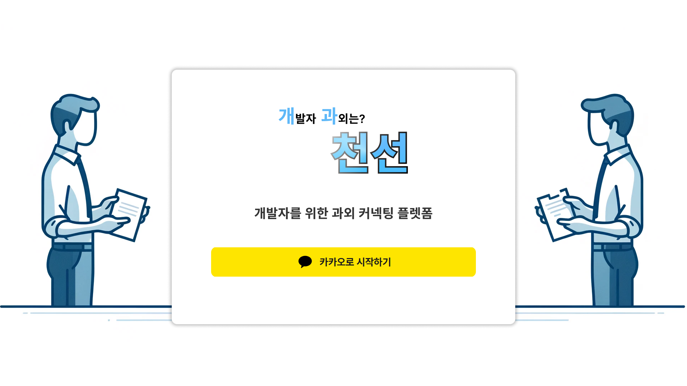
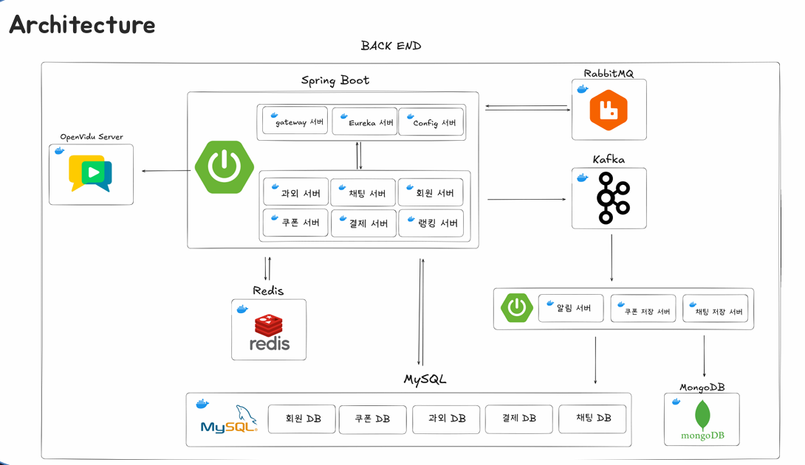
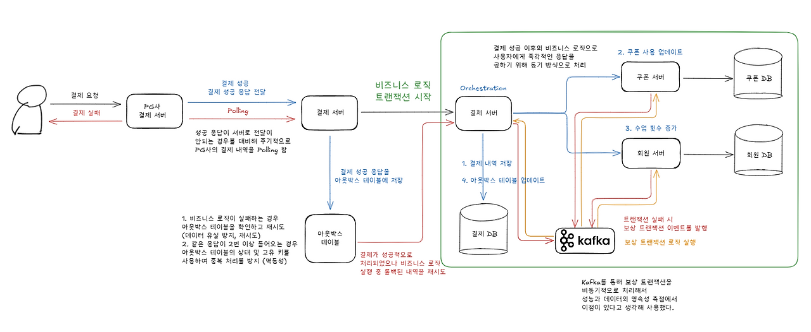

# 개과천선

## 프로젝트 소개
- 개발자와 학생을 연결하여 1:1 맞춤형 수업을 제공하는 과외 플랫폼으로, 강사-학생 매칭, 실시간 채팅, 결제 및 알림 기능을 통해 효율적인 학습 환경을 제공합니다

### 배포 주소
- ~~https://i12a505.p.ssafy.io/~~ 

## 주요 기능
1. 회원 기능 – 카카오 소셜 로그인 및 회원가입, JWT 기반 인증·인가 처리
2. 과외 기능 – 강사-학생 매칭, 과외 신청 및 수락
3. 결제 기능 – 결제 시스템, 쿠폰 발급 및 사용
4. 실시간 채팅 – WebSocket 기반 1:1 채팅
5. 알림 기능 – 과외 요청, 성사, 결제 성공 실시간 알림(SSE)

## 시스템 구성도

## 기술 스택
### Backend
- Java 17, Spring Boot
- Kafka, Redis, MySQL, MongoDB
- Docker, AWS EC2, AWS S3, Jenkins, Nginx

## 트러블 슈팅
### Back-End
#### 1. SAGA 패턴을 이용한 보상 트랜잭션 처리

- **문제 상황**
    - 외부 결제 API를 사용한 후, 내부 시스템에서 결제 내역 저장, 쿠폰 사용 요청, 수업횟수 추가 요청 등 **분산 트랜잭션 처리**가 필요했음
    - 사용자에게 **즉각적인 응답**을 반환해야 했으나, 기존 **비동기 SAGA 패턴**을 적용할 경우 사용자 경험이 저하되는 문제가 발생했음
- **문제 해결**
    - 결제 이후 로직: 동기 HTTP 호출 방식 적용
        - 결제 성공 시, 결제 서버(Orchestrator)가 **쿠폰 서버 및 회원 서버**에 **동기 요청**을 보내 즉시 처리하도록 변경
    - 보상 트랜잭션: 비동기 이벤트 기반 처리
        - 보상 트랜잭션은 즉각적인 응답이 필요하지 않으므로 **비동기 이벤트 기반**으로 전환하여 **성능 및 안정성 강화**
        - 보상 트랜잭션의 발생 빈도를 고려했을 때 **Kafka 사용이 오버스펙일 가능성**이 있었으나
            - **영속성 보장**이 필요했고
            - 이미 Kafka를 사용하고 있었기에 유지하는 것이 효율적이라 판단함
- **결과**
    - **SAGA 패턴**을 활용하여 분산 트랜잭션 관리 최적화
    - 즉각적인 응답을 제공하여 **사용자 경험을 개선**
    - 비동기 이벤트 기반 보상 트랜잭션 적용 및 **안정성** 강화
- **관련 포스팅**
    - https://bangbaeking.tistory.com/160
